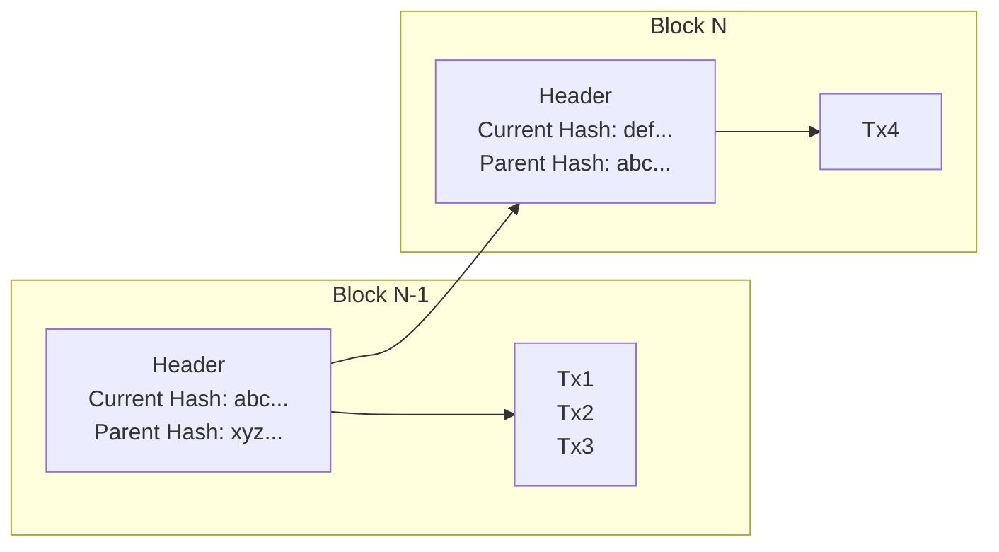

We begin our description of *how* blockchains work with this cheeky title, as it conveys a very important message: What we have discussed so far, most notably in [[Blockchain-Reimagined/Content/What/Index|"What"]] elaborated on Blockchains as [[Resilience]] [[State Machine]], 3 of the most important properties of which are: 
1. Verifiable execution and audit-ability of history
2. Correct ordering
3. Accessibility

Blockchain is merely the one of the main technologies (as a [data-structure](https://en.wikipedia.org/wiki/Data_structure)) that is used to achieved the above. That being said, we often (mistakenly) refer to the entire system as a "blockchain". To be pedantic, this is a wrong title, and why I assert blockchains are overrated. 

> That being said, I myself have and will give into to this mistake, and use the work "blockchain" to refer to an entire system that is built *using* a blockchain.

Specifically, blockchain only helps with verifying the ordering and audit-ability of the history. Blockchain is *not* the technology that delivers verifiable execution *at all*, or even establish *what* the correct order should be.

Let's dive further into understanding *what* Blockchains actually are, and then revisit this proposition at the end.
## Blockchain
Recall from [[Blockchain Models]] that transaction is synonym to a transition or mutation to the blockchain. Imagine we have a known correct order of 3 transactions. Without any special means, how can a new participant append a 4th one, while being able to prove the order of all the previous transactions? 

Blockchain is an efficient means to solving this very problem, and not much more.

A blockchain proposes to: 
- Bundle all transactions that are being added, in the right order, into a single ***block** of transactions*
- *Chain* these blocks together by referencing a [[Cryptographically Secured Hash]] of the previous block

The main novelty of the above is the `Header` of each block, which contains
- `current hash`: The **hash of the current block** of transactions
- A **hash of the parent block**, on top of which this block is meant to be valid

What the blockchain data structure achieves here is twofold: 
1. Assuming we have a large array of such blocks chained together, no previous block can be tampered with, **or else the chain of valid hashes will break**. This means no previous transaction can be added, removed, or modified
	2. Any new block is committing to a specified parent, growing the blockchain only in one canonical chain.
2. The hash of the header of the latest block contains a *digest* (via a [[Cryptographically Secured Hash]]) *of all the previous blocks as well*. This allows the blockchain to grow, without the need to always (re)hash all of the transactions. 
## Aside: Forks 
Recall from [[Execution, Ordering, History and State Machines]] that a blockchain might have two mutations that both adhere to a **valid execution**, but eventually they are two parallel views of the state, and we need to resolve by choosing one. This situation is called a **[[Fork]]**. 

Blockchain systems must be able to eventually resolve forks by choosing one over the other, which is called the **Canonical Chain**. The rules of how forks are resolved is up to the [[Consensus Algorithm]] of the blockchain, and vary from implementation to implementation.

> It is also possible that one of the forks is an **invalid execution**, but in principle, they can be treated the same: the role of the consensus algorithm is to resolve them into choosing the canonical one. 
## Overrated? 
In summary, a blockchain, as a data-structure, is an **append-only list of transactions**, with an easy way to ensure the history is not tampered with, mainly through chaining blocks of data together via the header's parent hash mechanism explained above.

It only provides the following: 

> Given a recent block that is know to be part of the canonical chain, you can be share that all of the blocks that can be successfully linked back via the parent hash were also valid. 

It is overrated, not? 

## Resilience
The true learning here is that **blockchains are a means to an end**. The goal is to create [[Resilience]] systems, or perhaps a [[Resilience]] web that we call [[Web3]]. Blockchain, as a data-structure contributed to this goal by giving us a system that allows the history to be audited in an efficient way. 

What is far more interesting to learn is how we can ensure the other aspects of [[Resilience]], such as verifiably and reliable execution. 

Next, in [[Proof of Work]] and [[Proof of Stake]] we learn how different [[Consensus Algorithm]] achieve this. 

Notes: 

- Verifiable, reliable execution: economic incentive
	- POW: if you diverge, but more than 2/3 of the network are not, you are merely wasting money, so you won't do it. Works, but it is wasteful
	- POS: capital at risk of being slashed. Economic security
- Auditability of history: Use of the [[Blockchains Are Overrated]] data-structure. 
- Accessibility and Permissionless: subjective measures. Allow anyone meeting some reasonable bar to become an author. Disincentivize any censorship