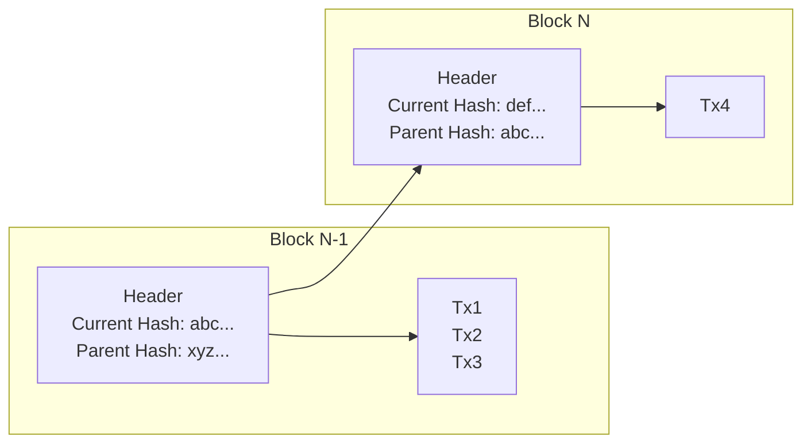

TODO: this chapter needs to be re-done as the first chapter of "HOW". 

The title of this (brief) chapter might strike you as a surprise, but it is by all means true, and in encapsulates a very interesting realization: 

Blockchain, *as a data structure*, is overrated. It only helps with verifying the ordering and audit-ability of the history. Blockchain is NOT the technology that delivers verifiable execution *at all*, or even establish *what* the correct order should be. 

Let's dive further into understanding *what* Blockchains actually are, and then revisit this proposition at the end.
## Blockchain

Imagine we have an establish correct order of 3 transactions[^1]. Without any special means, how can a new participant append a 4th one, while being able to prove the order of all the previous transactions? 

A naive way would be to always include the full list of previous

[1^]: recall from [[Blockchain Models]] that transaction is synonym to a transition or mutation to the blockchain.

Blockchain is solving this problem.

A blockchain proposes to: 
- Bundle all transactions that are being added, in the right order, into a single *block of transactions*
- *Chain* these blocks together by referencing a [[Cryptographically Secured Hash]] of the previous block

The main novelty of the above is the `Header` of each block, which contains
- The **hash of all the data in the current block** of transactions
- A **hash of the parent block**, on top of which this block is meant to be valid

What the blockchain data structure achieves here is twofold: 
1. Assuming we have a large array of such blocks chained together, no previous block can be tampered with, or else the chain of valid hashes will break. This means
	1. No previous transaction can be added, removed, or modified
	2. Any new block is committing to a specified parent, growing the blockchain only in one canonical chain.
2. The hash of the header of the latest block contains a digest (via a [[Cryptographically Secured Hash]]) of all the previous blocks as well. This allows the blockchain to grow, without the need to always (re)hash all of the transactions. 
## Aside: Forks 

Recall from [[Execution, Ordering and History Yields State Machine]] that a blockchain might have two mutations that both adhere to a **valid execution**, but eventually they are two parallel views of the state, and we need to resolve by choosing one. This situation is called a **[[Fork]]**. 

Blockchain systems must be able to eventually resolve forks by choosing one over the other, which is called the **Canonical Chain**. The rules of how forks are resolved is up to the [[Consensus Algorithm]] of the blockchain, and vary from implementation to implementation.

> It is also possible that one of the forks is an **invalid execution**, but in principle, they can be treated the same: the role of the consensus algorithm is to resolve them into choosing the canonical one. 
## Overrated? 

In summary, a blockchain, as a data-structure, is an **append-only list of transactions**, with an easy way to ensure the history is not tampered with.

It only provides the following: 
- Given the current block header, and its hash, you can be sure that if that block is valid, and part of the canonical chain, the entire chain of blocks that 

What the correct order of transactions in 

## Resilience

Blockchains are a means to an end; the goal is to create [[Resilience]] systems, or perhaps a [[Resilience]] web that we may call [[Web3]]. 