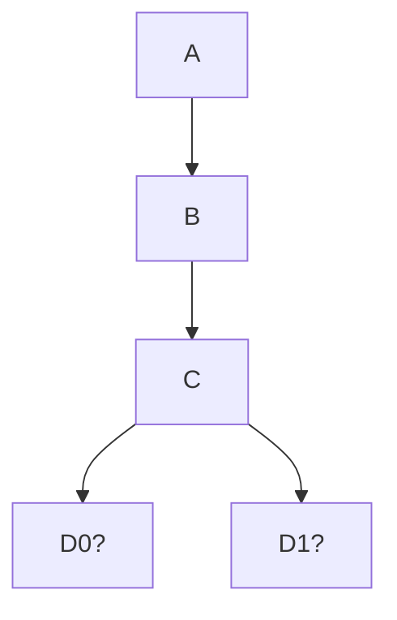

When a blockchain has multiple branches, also called "tips of the chain", and is not sure yet which one is the correct one.  

These concurrent tips need to be eventually resolved into one. The correct fork is called the **canonical chain**.